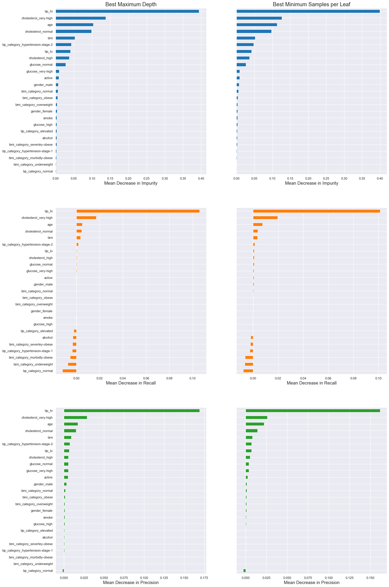
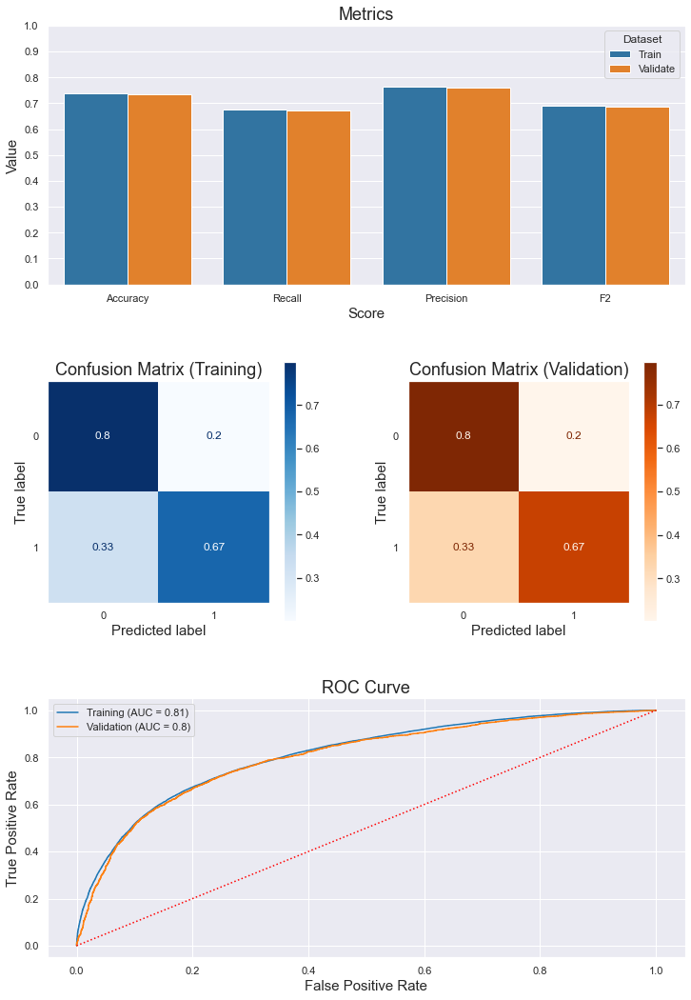

# Building a Classifier to Predict Cardiovascular Disease

##### **Author: _Suleyman Qayum_**

<br>

## Business Understanding

Cardiovascular disease is the term for all types of diseases that affect the heart and/or blood vessels, including coronary heart disease (clogged arteries), which can cause heart attacks, stroke, congenital heart defects and peripheral artery disease. According to the *National Heart, Lung, and Blood Insitute (NHLBI)*, more than 800,000 people die of cardiovascular disease every year in the United States alone.

> *As part of an initiative to reduce the number of deaths related to cardiovascular disease in the United States, the *U.S. Department of Health and Human Services (HHS)* have allocated funding for the development of a machine learning model that can accurately predict whether or not a patient is at risk for cardiovascular disease. The eventual goal is to deploy such a model and integrate it into the major EHR systems as a preliminary screening tool for cardiovascular disease. They also request that the most important features be identified.*

<br>

## Data Understanding

### Overview

> *The dataset describes basic medical information for 69,301 patients. In addition to being factors that contribute to cardiovascular disease, __the features of this dataset were chosen for their simplicity and the fact that they can be easily and quickly obtained in a medical setting__. As a result, they fall under 3 basic categories with respect to their origin:*
> * _Objective Patient Information:_ basic information about the patient that can be verified as truth (*i.e. age, height, weight, and gender*)
> * _Subjective Patient Information:_ basic information about the patient that cannot be verified, but is accepted as truth (*i.e. whether or not the patient smokes, drinks alcohol, or is physically active*)
> * _Measurement:_ simple blood measurements (*e.g. blood pressure, cholesterol and glucose levels*)

### Features

> __The dataset consists of 11 input features and 1 target variable:__

> * __age__ *[int | continuous] - patient's age (years)*
> * __height__ *[int | continuous] - patient's height (cm)*
> * __weight__ *[float | continuous] - patient's weight (kg)*
> * __gender__ *[int | categorical] - patient's gender*
>   - *1 = male*
>   - *2 = female*
> * __bp_hi__ *[int | continuous] - patient's systolic blood pressure*
> * __bp_lo__ *[int | continuous] - patient's diastolic blood pressure*
> * __cholesterol__ *[int | categorical] - patient's cholesterol level*
>   - *1 = normal*
>   - *2 = high*
>   - *3 = very high*
> * __glucose__ *[int | categorical] - patient's glucose level*
>   - *1 = normal*
>   - *2 = high*
>   - *3 = very high*
> * __smoking__ *[bool] - indicates whether or not the patient is a smoker*
>   - *0 = patient is a non-smoker*
>   - *1 = patient is a smoker*
> * __alcohol__ *[bool] - indicates whether or not the patient drinks alcohol*
>   - *0 = patient dos not drink alcohol*
>   - *1 = patient drinks alcohol*
> * __active__ *[bool] - indicates whether or not the patient is physically active*
>   - *0 = patient is not physically active*
>   - *1 = patient is physically active*

---

> * __[Target Variable]__ __cardio__ *[bool]  - indicates the presence or absence of cardiovascular disese in the pateint*
>   - *0 = patient does not suffer from cardiovascular disease*
>   - *1 = patient suffers from cardiovascular disease*

### Issues

> *Given the fact that that the patients in the dataset range from 35 to 60 years old, the outliers listed below give rise to alarming discrepencies*:
> - *heights under $120\ cm\ (\approx 4\ ft)$ and above $245\ cm\ (\approx\ 8\ ft)$*
> - *weights under $30\ kg\ (\approx 66\ lbs)$*
> - *diastolic (`bp_lo`) and systolic (`bp_hi`) blood pressures:*
>   - *less than $0\ mmHg$ (physically impossible)*
>   - *under $30\ mmHg$ (extremely unlikely)*
>   - *above $500\ mmHg$ (a person would explode - cusing death)*


> *The `bp_lo`, `bp_hi`, `height`, and `weight` features are not normally distributed throughout the dataset:*
> - *`bp_lo`, `bp_hi` are extremely right-skewed*
> - *`height` is left-skewed with a jagged curve at the median*
> - *`weight` is right-skewed with a jagged curve at the median*

<br>

## Data Preparation

### *Data Cleaning*

Entries containing negative values for `bp_hi` or `bp_lo` were removed immediately due tosuch values being physically impossible. The  continuous numerical features (`bp_lo`, `bp_hi`, `height`, and `weight`) contained outliers, many of which did not make sense from a physiological point of view. These outliers were removed using the inter-quartile range method, such that the distributions of the these numerical predictors were no longer skewed or contained absurd values.

### *Feature Engineering*

#### *__`bmi`__ & __`bmi_category`__*

*__Obesity is known to have a causal link with cardiovascular disease.__ This condition is categorized by calculating the __Body Mass Index (BMI)__ for each patient in the dataset, and then using this BMI to determine the patient's weight category.*
- *BMI was calculated using the following formula:*
$$ BMI = \dfrac{weight(kg)}{[height(m)]^2} $$
- *Using BMI, a patient's weight class was determined from the following table:*
<br>
<center></center>

#### *__`bp_category`__*

*__Hypertension is also known to have a causal link with cardiovascular disease.__ This condition is categorized a patient's blood pressure level, which will be determined from the following table:*
<br>
<center></center>

### *Encoding Categorical Features*

The `glucose`, `cholesterol`, `gender`, `bmi_category`, and `bp_category` features were one-hot encoded via the `OneHotEncoder` transformer.

### *Scaling the Feature Matrix*

The feature matrix was standardized using a `StandardScaler` object. The scaler was fitted to the training data only, and then used to scale the training, validation, and test sets. This was done to ensure no data leakage ocurred.

<br>

## Modeling

### *Scoring*

A custom $F_2$ scorer was created and used to measure training loss during validation and evaluate models when searching a parameter grid. This score is meant to emphasize recall without compromising precision. The formula for the $F_2\text{-Score}$ is based on the more general $F_\beta\text{-Score}$:
> $$ F_\beta = \dfrac{(1 + \beta^2)PR}{\beta^2 P + R}$$
> $\beta = 2 $
> $ P = \text{precision} $
> $ R = \text{recall} $


### *Classifiers*

##### **Random Forest**

A `RandomForestClassifier` base estimator was fit to the training dataset. The training loss was minimized by first adjusting the maximum depth of its trees, resulting in the `rfc_bestMaxDepth_1` classifier. Starting from the base estimator again, the minimum number of samples required for a node to become a leaf was adjusted until training loss was again minimized, resulting in the `rfc_bestMinSamplesLeaf_1` classifier. After some feature adjustment (discussed below), another pair of randomized forests, `rfc_bestMaxDepth_2` and `rfc_bestMinSamplesLeaf_2`, were created as updated versions of the previous two.

*The random forest classifiers, along with their optimized hyperparameters, are listed below:*
> `rfc_bestMaxDepth_1 = RandomForestClassifier(max_depth=9, n_jobs=-1, random_state=0)`
> `rfc_bestMinSamplesLeaf_1 = RandomForestClassifier(min_samples_leaf=35, n_jobs=-1, random_state=0)`
> `rfc_bestMaxDepth_2 = RandomForestClassifier(max_depth=8, n_jobs=-1, random_state=0)`
> `rfc_bestMinSamplesLeaf_2 = RandomForestClassifier(min_samples_leaf=39, n_jobs=-1, random_state=0)`

*The validation metrics for the final two random forest classifiers (`rfc_bestMaxDepth_2` and `rfc_bestMinSamplesLeaf_2`) are shown below:*

##### **Logistic Regression**

A `LogisticRegression` estimator was fit to the training set and the regularization (`C`) parameter that minimized training loss was found with a grid search, resulting in the `logreg_best` estimator.

*The parameter information for `logreg_best` is shown below:*

> `logreg_best = LogisticRegression(C=0.0138643651488824, max_iter=10000, random_state=0,
                   solver='saga')`

##### **K-Nearest Neighbors (KNN)**

A `KNeighborsClassifier` estimator was fit to the training set. The number of neighbors (`n_neighbors` parameter) and distance metric (`p`) that minimized training loss were found through a grid search, resulting in the `knn_best` estimator.

*The parameter information for `knn_best` is shown below:*
> `knn_best = KNeighborsClassifier(n_jobs=-1, n_neighbors=21, p=3)`

##### Bagging Classifier [KNN Base Estimator]

A `BaggingClassifier`, with `knn_best` as the base estimator, was fit to the training data and optimized in a grid search in order to reduce the variation of `knn_best`. This classifier was named `bagged_knn_best`.


*The parameter information for `bagged_knn_best` is shown below:*
>`bagged_knn_best = BaggingClassifier(base_estimator=KNeighborsClassifier(n_jobs=-1,
                                                                        n_neighbors=21,
                                                                         p=3),
                                     bootstrap_features=True,
                                     max_features=0.5,
                                     max_samples=0.75,
                                     n_jobs=-1,
                                     random_state=0)`
<br>

## Results

### *Feature Importances*

Impurity-based and permutation-based feature importances (with respect to recall and precision) were extracted from `rfc_bestMaxDepth_1` and `rfc_bestMinSamplesLeaf_1`.

*These feature importances are shown below:*

<center></center>

It can be concluded from the plots displaying impurity-based importances that the tree-based models struggled to split the one-hot encoded features that were engineered in *Part C* (i.e. the `bmi_category` and `bp_category` columns), possibly because they have too many levels. This, in turn, means that only a small fraction of the data belongs to some of these levels, and the corresponding one-hot encoded columns will mostly contain zeros. It follows that splitting on this column produces a relatively small reduction in impurity, causing the tree-based algorithms to ignore these columns in favor of others.

With respect to the plots displaying permutation-based importances, it can also be seen that the `severley-obese`, `morbidly-obese`, and `underweight` levels of `bmi_category`, along with the `normal`, `elevated`, and `hypertension-stage-1` levels of `bp_category`, were actually detrimental to the recall of both models, since the recall scores for both `rfc_bestMaxDepth` and `rfc_bestMinSamplesLeaf` increased upon permutation of these categories.

To alleviate these problems, the levels belonging to `bmi_category` and `bp_category` were grouped together.

> *The BMI levels were grouped in such a way that the `overweight`, `severley-obese`, `morbidly-obese`, and `underweight` levels were eliminated. As a result, the BMI levels were grouped as:*
> - **`not-obese` = {`underweight`, `normal`, `overweight`}**
> - **`obese` = {`obese`, `severley-obese`, `morbidly-obese`}**
> *The grouped columns were then merged into a single binary column called **`obese`**.*

> *Similarly, the BP levels were grouped in such a way that the `normal`, `elevated`, and `hypertension-stage-1` levels were eliminated. As a result, the BP levels were grouped as:*
> - **`not-hypertension-stage-2` = {`normal`, `elevated`}**
> - **`hypertensive` = {`hypertension-stage-1`, `hypertension-stage-2`}**
> *The grouped columns above were then merged into a single binary column called **`hypertension`**.*

The `rfc_bestMaxDepth_2` and `rfc_bestMinSamplesLeaf_2` were trained on the adjusted dataset and used to extract updated feature importances.

*These updated feature importances are shown below:*

<center></center>

The updated feature importances shown above indicate that creating the `obese` and `hypertension` features somewhat decreased the overall loss in recall (as calculated by permutating features). However, the problem of features being detrimental to recall persists. Also, the `hypertension` column itself became detrimental to both recall and accuracy, and possibly should have been removed. This strongly indicates that engineering `bp_categories` was unwise.

Overall the most important features were:
> - Systolic Blood Pressure (`bp_hi`)
> - Cholesterol Level (`cholesterol_normal`, `cholesterol_high`, and `cholesterol_very-high`)
> - Age (`age`)
> - Body Mass Index (`bmi`)
> - Diastolic Blood Pressure (`bp_lo`)
> - Glucose Level (`glucose_normal`, `glucose_very-high`)

### *Validation Against the Test (Hold-Out) Set*

*The validation metrics for predictions against the test (hold-out) set for each model is shown below:*

#### *Randomized Forest (Optimized for `max_depth`)*
> `RandomForestClassifier(max_depth=8, n_jobs=-1, random_state=0)`

The validation metrics `rfc_bestMaxDepth` indicate that:
> - *out of all the patients that did not have cardiovascular disease, $82\%$ of them were predicted correctly*
> - *out of all the patients that did have cardiovascular disease, $65\%$ of them were predicted correctly*
> - *the model generalizes well to the training data (overfitting has not occured)*

<center></center>


#### *Randomized Forest (Optimized for `min_samples_leaf`)*
> `RandomForestClassifier(min_samples_leaf=39, n_jobs=-1, random_state=0)`

The validation metrics for `rfc_bestMinSamplesLeaf` indicate that:
> - *out of all the patients that did not have cardiovascular disease, $80\%$ of them were predicted correctly*
> - *out of all the patients that did have cardiovascular disease, $67\%$ of them were predicted correctly*
> - *the model generalizes well to the training data (overfitting has not occured)*

<center></center>

#### *Logistic Regression*
> `LogisticRegression(C=0.0138643651488824, max_iter=10000, random_state=0, solver='saga')`

The validation metrics for `logreg_best` indicate that:
> - *out of all the patients that did not have cardiovascular disease, $79\%$ of them were predicted correctly*
> - *out of all the patients that did have cardiovascular disease, $65\%$ of them were predicted correctly*
> - *the model generalizes well to the training data (overfitting has not occured)*

<center></center>

#### *K-Nearest Neighbors (KNN)*
> `KNeighborsClassifier(n_jobs=-1, n_neighbors=21, p=3)`

The validation metrics below indicate that:
> - *out of all the patients that did not have cardiovascular disease, $76\%$ of them were predicted correctly*
> - *out of all the patients that did have cardiovascular disease, $69\%$ of them were predicted correctly*
> - *there is a noticeable decrease in all scores when evaluated against the training set (slight overfitting has occured)*

<center></center>


#### *Bagging Classifier (KNN Base Estimator)*
> `BaggingClassifier(base_estimator=KNeighborsClassifier(n_jobs=-1, n_neighbors=21, p=3), bootstrap_features=True, max_features=0.5, max_samples=0.75, n_jobs=-1, random_state=0)`

The validation metrics below indicate that:
> - *out of all the patients that did not have cardiovascular disease, $76\%$ of them were predicted correctly*
> - *out of all the patients that did have cardiovascular disease, $70\%$ of them were predicted correctly*
> - *the model generalizes well to the training data (overfitting has not occured)*

<center></center>

### *Summary of Model Performances*

<center></center>


<br>

## Conclusion

> *The above table table indicates that the Bagging Classifier with a KNN base estimator (`bagged_knn_best`) performed best overall when predicting against the training set, with a score of $0.7$ or higher for all metrics. Most importantly, this model had the highest recall, with a score of $0.706$. Therefore, `bagged_knn_best` will be chosen for further development.*

Although chosen as the best candidate, `bagged_knn_best` is not ready for use as a screening tool for cardiovascular disease. This is due to the fact that its recall is still unacceptably low, and needs to be improved. That is, its recall score of $0.706$ implies that 3 out of 10 sick patients will be incorrectly classified as healthy. Given the potentially life-threatening consequences of such a misclassification, the rate at which it ocurrs must be reduced (i.e. recall must be increased). In terms of its utility as a screening tool, an accuracy of $0.736$ is also too low, and needs improvement.

> *The following features were determined to be of primary importance when predicting cardiovascular disease, and therefore must be used in future iterations of this model:*
> - *Systolic Blood Pressure (`bp_hi`)*
> - *Cholesterol Level (`cholesterol_normal`, `cholesterol_high`, and `cholesterol_very-high`)*
> - *Age (`age`)*
> - *Body Mass Index (`bmi`)*
> - *Diastolic Blood Pressure (`bp_lo`)*
> - *Glucose Level (`glucose_normal`, `glucose_very-high`)*

With respect to the `cholesterol` and `glucose` features however, effort needs to be made to collect this data as continuous measurements, instead of being crudely classified into 3 levels. Similarly, features like `smoke`, `alcohol`, and `active` are too vague to be useful as predictive variables because of their binary format. If a patient is to answer these questions, they should respond with a quantity instead of a yes/no answer. This would benefit the accuracy of the models and is likely to improve recall.

<br>

## Limitations & Ideas for Further Analysis

Finding additional features and obtaining more data on which to train the model are both vitally important for improvement. It would be prudent to access the API of awidely-used EHR system and start gathering data that is the same as, and similar to, the features used in this analysis. In conjunction with this, it is highly recommended that a consultant with domain-specific knowledge (i.e. a cardiologist) be brought in to help make sense of features, point out highly correlated features, recommend new features, and aid with feature selection.

Additionally, combining the models into a single classifier by feeding them into ensemble methods shuch as a Voting Classifier or Stacking Classifier could have improved results.

Finally, narrowing the scope of the target label to a specific disease (i.e. heart disease or stroke) instead of the entire class of cardiovascular diseases would be highly beneficial, as this would allow us to select features specific to that disease, instead of trying to find features that contribute to cardiovascular disease in general.
<br>

## Further Information

Review the full analysis in the [ Jupyter Notebook](./predicting-cardiovascular-disease.ipynb) or the view the [Presentation](./Predicting_Cardiovascular_Disease_Presentation.pdf).

*For any additional questions, please contact:*

> **Suleyman Qayum (sqayum33@gmail.com)**

<br>

## Repository Structure
```
├── data
    └── cardio_disease_data.csv
├── images
    ├── bagged-knn-best.pmg
    ├── bp_index.png
    ├── feature-importances-1.png
    ├── feature-importances-2.png
    ├── knn-best.png
    ├── logreg-best.png
    ├── obesity_index.png
    ├── rfc-bestMaxDepth.png
    └── rfc-bestMinSamplesLeaf.png
├── Predicting_Cardiovascular_Disease_Presentation.pdf
├── predicting-cardiovascular-disease.ipynb
├── classifier_utils.py
└── README.md
```
